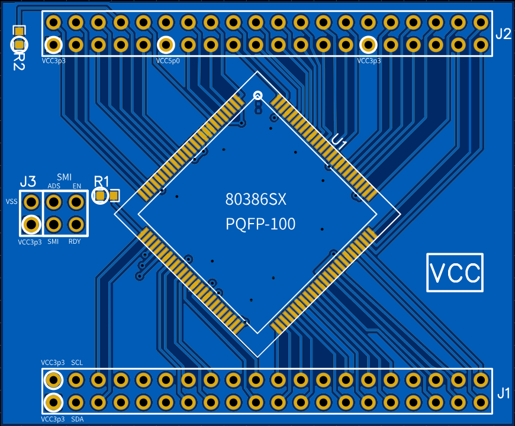
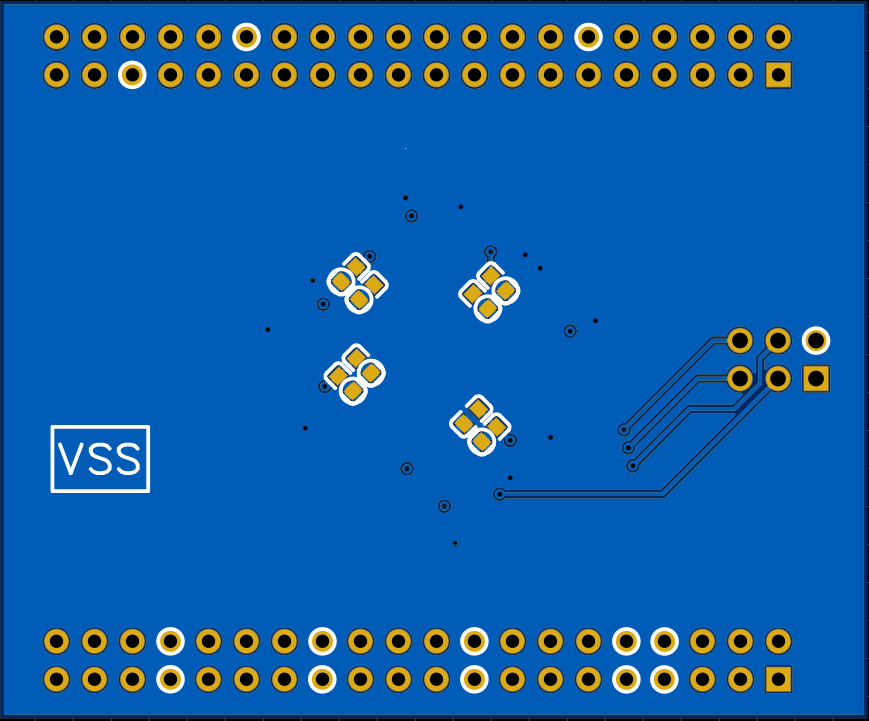
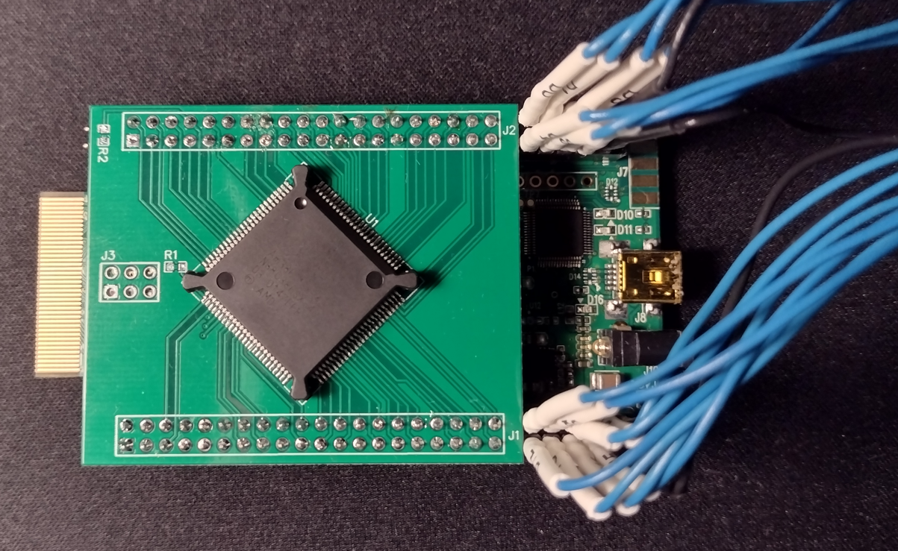
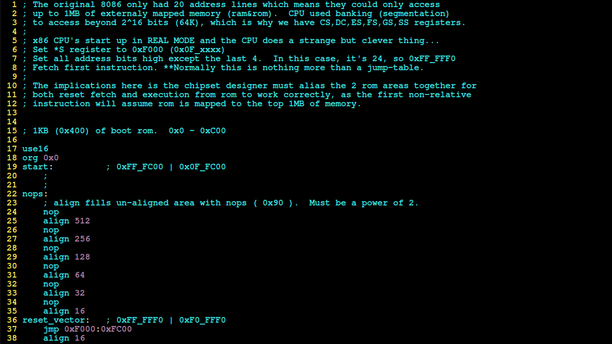
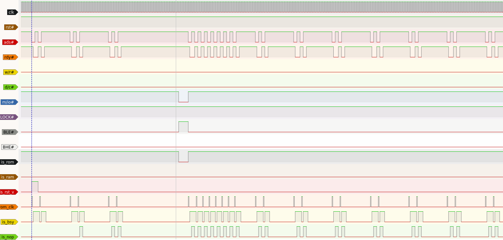

# AM386-SX DEVELOPMENT BOARD
- Introduction
- Problem statement
- Design goals
- Design Constraints
- Benefits

## INTRODUCTION

 Implementing any FPGA independant soft-core processor is difficult.  The complexity, maturity, coding style, software compatability varies wildly from core to core.  x86 isn't going anywhere any time soon for example,  8051 processors are still widly used in embedded designs.  The 80386 32-bit microprocessor is considered by many as the 1st "real" 32-bit microprocessor.  It's paging and protected mode structure continues to this day.

 So my thinking here is why not (for now) just use a cheap hardware processor plugged into an FPGA board?

 The purpose of this project is to develop a "baseline" model using a hardware CPU so a soft-core x86 processor can be implimented with full software compatability.  This isn't a new idea and has been done many times.  However, the complexity is high and many times there is so much "magic" under the hood that it's easy to get lost and give up. 

 My goal here is to create something that is flexible, yet basic enough to be used as a teaching tool.

## PROBLEM STATEMENT
- overly complex cores take longer to discect and impliment.
- lack of documentation or examples.
- lack of software support.  For example, if you roll your own core, you'll also have to either write all your own software, or write a compiler.  Neither are good options.

## DESIGN GOALS
- x86 microprocessor (hardware)
- UART interface
- Off the shelf compatability with assemblers (FASM)

### NICE TO HAVES
 - VGA
 - -- VGA BIOS
 - -- SVGA EXTENTIONS
 - BIOS that boots dos
 - BIOS that boots linux
 - SDCARD for storage
 - GCC

### DESIGN CONSTRAINTS

- 3.3v operation (for use with FPGA and modern memories).
- low pin count
- cheap development board compatability. SDRAM?
- Common parts (AM386-SX still being manufactured)
- PCB design

### BENEFITS
### Development
### Part selection

- FPGA development board
- CPU Selection 

### PCB / Schematic

- Number of signals?
- FPGA Firmware

### What components are needed to get the CPU to come out of reset and fetch the reset vector?

- CPU Software
- Reset fetch / JUMP / NOP

#### Designing a chipset
- Must control CPU, RAM, ROM, IO
- Must act as an arbitrator for those busses.
- Must act as address decoder for special cases (reset vector, rom, ram etc).
- Must multi-plex interrupt pin and deliver NMI (non-maskable interrupt).

#### Reset fetch and LONG JUMP to ROM region in LONG MODE

The original 8086 only had 20 address lines which means they could only access
up to 1MB of externaly mapped memory (ram&rom).  CPU used banking (segmentation) 
to access beyond 2^16 bits (64K), which is why we have CS,DC,ES,FS,GS,SS registers.

 
 x86 CPU's start up in REAL MODE and the CPU does a strange but clever thing...
Set *S register to 0xF000 (0x0F_xxxx)
Set all address bits high except the last 4.  In this case, it's 24, so 0xFF_FFF0
Fetch first instruction. **Normally this is nothing more than a jump-table.

 
The implications here is the chipset designer must alias the 2 rom areas together for
both reset fetch and execution from rom to work correctly, as the first non-relative 
instruction will assume rom is mapped to the top 1MB of memory.

### Reference
https://web.archive.org/web/20160123145327/https://blog.lse.epita.fr/articles/77-lsepc-intro.html
