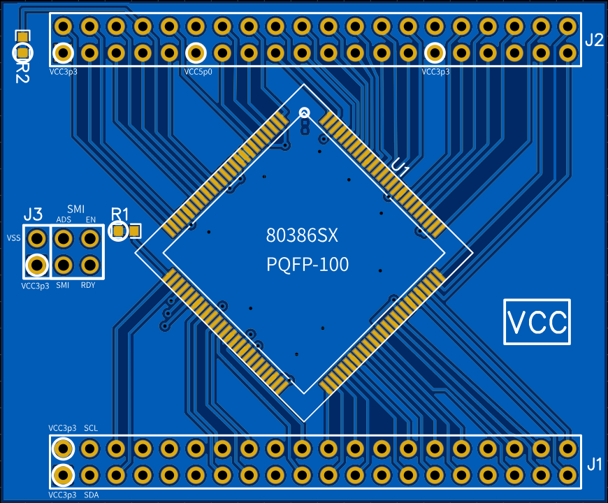
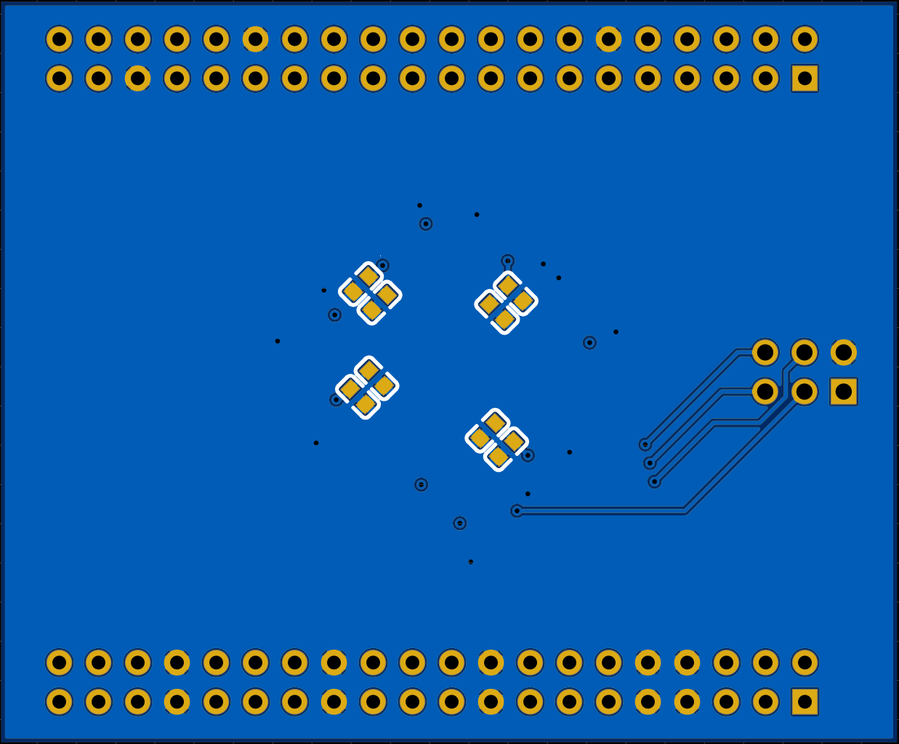

# AM386-SX DEVELOPMENT BOARD
- Introduction
- Problem statement
- Design goals
- Design Constraints
- Benefits

## INTRODUCTION

 Implimenting any FPGA independant soft-core processor is difficult.  The complexity, maturity, coding style, software compatability varies wildly from core to core.  x86 isn't going anywhere any time soon for example,  8051 processors are still widly used in embedded designs.  The 80386 32-bit microprocessor is considered by many as the 1st "real" 32-bit microprocessor.  It's paging and protected mode structure continues to this day.

 So my thinking here is why not (for now) just use a cheap hardware processor plugged into an FPGA board?

 The purpose of this project is to develop a "baseline" model using a hardware CPU so a soft-core x86 processor can be implimented with full software compatability.  This isn't a new idea and has been done many times.  However, the complexity is high and many times there is so much "magic" under the hood that it's easy to get lost and give up. 

 My goal here is to create something that is flexible, yet basic enough to be used as a teaching tool.

## PROBLEM STATEMENT
- overly complex cores take longer to discect and impliment.
- lack of documentation or examples.
- lack of software support.  For example, if you roll your own core, you'll also have to either write all your own software, or write a compiler.  Neither are good options.

## DESIGN GOALS
- x86 microprocessor (hardware)
- UART interface
- Off the shelf compatability with assemblers (FASM)

### NICE TO HAVES
